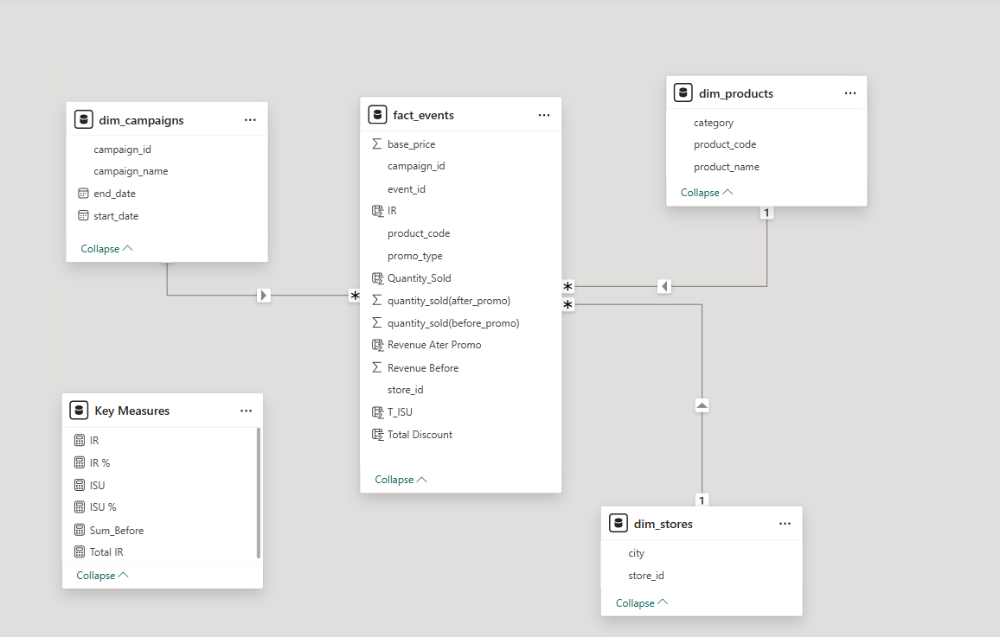

# Festive Sales Promotion Analytics Dashboard
[View Live Dashboard](https://app.powerbi.com/view?r=eyJrIjoiOGI4NDFlZDgtODZjMS00OTVkLTgzMDctZmM3ZGRiOGVkMjc3IiwidCI6IjAzMWEzYmJjLWNmN2MtNGUyYi05NmVjLTg2NzU1NTU0MGExYyJ9)

# AtliQ Mart’s Diwali & Sankranti Promotions!

This repository contains the SQL scripts used to analyze the performance of promotional campaigns run by AtliQ Mart during Diwali 2023 and Sankranti 2024. The project addresses various business requests related to identifying high-value discounted products, store distribution, campaign effectiveness, and product performance in terms of incremental sales and revenue.

## Objective

Promotional campaigns play a crucial role in the retail industry, driving sales and attracting customers during festive seasons. This project aims to analyze the performance of promotional campaigns conducted by AtliQ Mart during Diwali 2023 and Sankranti 2024. By leveraging data analytics, we seek to gain insights into the effectiveness of these campaigns and provide recommendations for optimizing future marketing strategies.

## Data Sources

The analysis is based on data obtained from AtliQ Mart's internal databases. The main datasets used include fact_events, dim_products, dim_stores, and sales_summary. These datasets contain information about product sales, store locations, promotional events, and campaign revenues.

## Project Overview:

1. Analyzed data from AtliQ Mart's internal databases.
2. Performed SQL queries to fulfill five business requests.
3. Insights are intended to inform future promotional strategies and resource allocation.
# Data Model

## Results and Insights

The analysis revealed several key insights:

- High-value products featured in 'BOGOF' promotions.
- Distribution of stores across different cities.
- Total revenue generated before and after each promotional campaign.
- Incremental sold quantity and revenue percentage during the Diwali campaign.
- Top 5 products ranked by incremental revenue percentage.

These insights can help AtliQ Mart make informed decisions for future promotional activities, optimize resource allocation, and improve overall sales performance.

## Store Performance Analysis

- Bengaluru has the highest number of stores (10), followed by Chennai (8) and Hyderabad (7).

- The top 10 stores generating the highest incremental revenue are mainly located in Bengaluru, Chennai, and Mysuru.

 - The bottom 10 stores with the lowest incremental sold units (ISU) are mostly from Trivandrum, Mangalore, and Vijayawada.

- Focus on categories that bring the highest Incremental Revenue (IR) — such as Grocery & Staples, Home Appliances, and Combo1.

- Give priority to cities with the highest incremental revenue percentage, especially Madurai, Chennai, and Bengaluru.

## Promotion Type Insights
- Leverage Effective Promotion Types: Focus on successful promotions like ₹500 Cashback and BOGOF (Buy One Get One Free), as they have a strong positive impact on Incremental Revenue and Unit Sales.

- Avoid Ineffective Discounts: Avoid running discount-based promotions, especially 25% OFF and 33% OFF, since they have shown limited impact on revenue growth.

- Optimize Seasonal Promotions: Concentrate on improving Diwali promotions, as they generate higher revenue compared to Sankranti. Adjust strategies to make the most of this festive period.

### Product and Category Analysis

- Maximize Revenue from High-Performing Categories: Allocate resources towards categories with the highest incremental revenue growth, such as Home Appliances and Home Care.
- Promote Top Revenue Generating Products: Focus on products like the Atliq Waterproof Immersion Rod, Atliq LED Bulb and Atliq Double Bedsheet Set to capitalize on their strong revenue contributions. Thank

## Future Work

Future work could include:
- Exploring additional datasets to gain deeper insights into customer behavior and preferences.
- Conducting more granular analysis on specific product categories or regions.
- Implementing machine learning models for predictive analytics to forecast sales and optimize promotional strategies.
